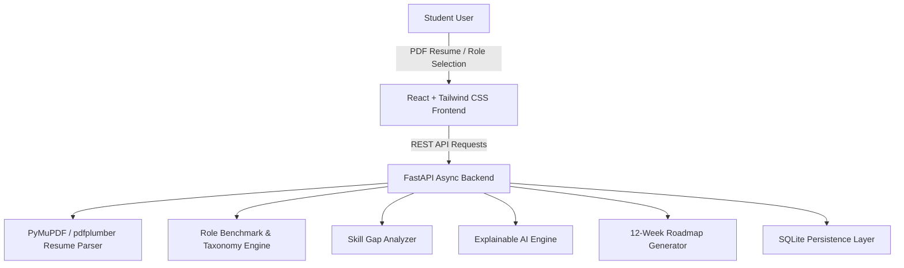

# PathFinder AI — Intelligent Student Success Ecosystem

> *"Helping students discover the smartest path from skills to success."*  
> **Team Twix:** Golla Abhinav Kumar (Team Lead), Rachana Bonigala (AI Core & NLP) • BTech AI, 3rd Year • SVNIT Surat

---

## 🌟 Overview
**PathFinder AI** is an AI-powered career navigation platform designed to eliminate the guesswork from student career development. By combining deep NLP resume parsing, industry-grade skill taxonomies, explainable AI recommendation algorithms, and dynamic multi-phase learning roadmaps, PathFinder AI gives every student a personalized, transparent path to their target tech role.

---

## 🚀 Key Features

### 1. 📄 Resume Intelligence Parser
- Extracts contact details, education, work experience, projects, and skills from PDF and text resumes.
- Automatically maps skill variations and aliases to canonical taxonomy terms.
- Computes a comprehensive 0–100 Profile Completeness & Strength rating.

### 2. 🎯 Dynamic Skill Gap Analysis
- Benchmarks student profiles against 5 key industry career tracks:
  - **AI / Machine Learning Engineer**
  - **Full Stack Web Developer**
  - **Data Scientist / Analytics Lead**
  - **Cloud & DevOps Engineer**
  - **Cybersecurity & AppSec Specialist**
- Computes weighted readiness match percentage across **Core Foundations (55%)**, **Advanced Competencies (30%)**, and **Tooling & DevOps (15%)**.

### 3. 💡 Explainable AI Recommendations
- Provides transparent reasoning for why every missing skill is recommended.
- Highlights real-world market demand statistics, estimated completion effort, and actionable next steps.

### 4. 🗺️ Personalized 12-Week Learning Roadmap
- Generates an actionable 4-phase milestone learning plan tailored specifically to the candidate's missing competencies.
- Includes weekly learning checkpoints, curated documentation links, and project deliverables.
- Interactive checklist tracking with celebration confetti animations.

### 5. 👥 AI Mentor & Opportunity Discovery Engine
- Matches students with industry mentors from top tech companies (Google DeepMind, Stripe, Microsoft Azure).
- Curates verified hackathons (e.g. Smart India Hackathon 2026) and internship opportunities.

### 6. 📊 Interactive Pitch Deck Modal
- Built-in 9-slide interactive presentation viewer summarizing the project vision and architecture.

---

## 🏗️ Technical Architecture



- **Frontend:** React 19 + Vite + Tailwind CSS v4 + Lucide Icons + Canvas Confetti
- **Backend:** FastAPI (Python 3.13) + Uvicorn + Pydantic + Scikit-Learn
- **Resume Extraction:** `pdfplumber` + `pypdf` + Regex NLP heuristics
- **Database:** SQLite (`pathfinder.db`)

---

## ⚡ Quick Start Guide

### 1. Start Backend Server
```bash
cd backend
python main.py
# Server runs at http://127.0.0.1:8000
# Swagger API docs at http://127.0.0.1:8000/docs
```

### 2. Start Frontend Application
```bash
cd frontend
npm run dev
# App runs at http://localhost:5173
```

---

## 🧪 Testing the APIs

Run the automated backend test suite:
```bash
cd backend
python test_core_engine.py
```
